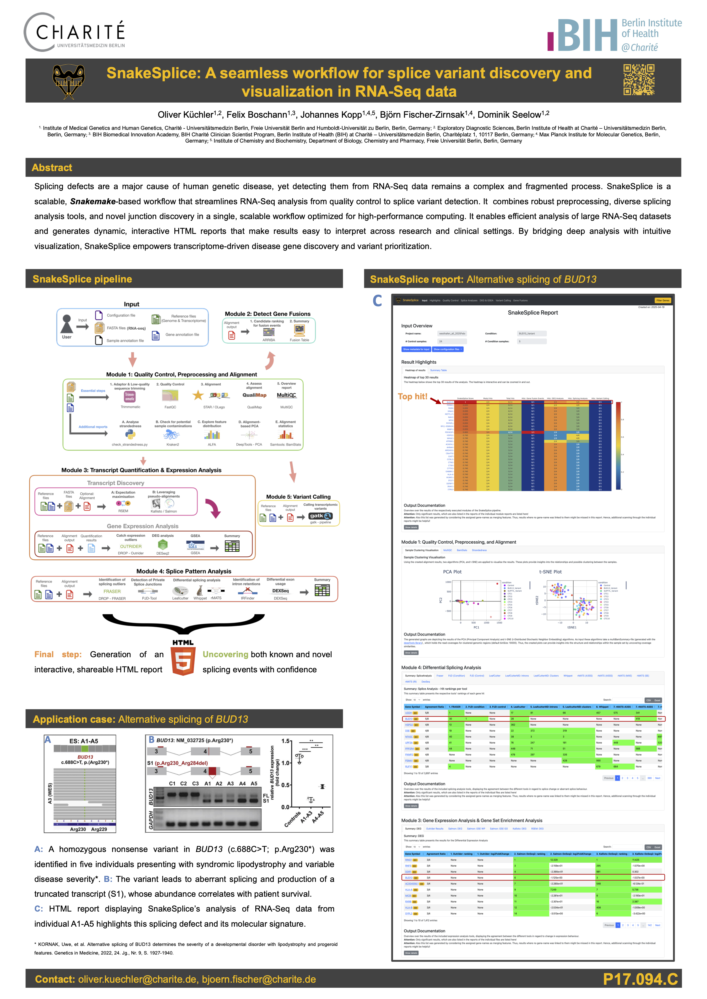

# SnakeSplice
> [!CAUTION]
> This repository is out of date. Please contact oliver.kuechler@charite.de to get more information and access to an up-to-date version.

## About
A Snakemake based modular Workflow that facilitates RNA-Seq analyses with a 
special focus on the exploration of differential splicing behaviours.

## Table of contents
- [Snake Splice Modules](#snake-splice-modules)
- [Software Requirements](#software-requirements)
- [Usage](#usage)
  * [Input Data](#input-data)
    + [Starting with FASTQ files](#starting-with-fastq-files)
    + [Starting with BAM files](#starting-with-bam-files)
  * [Reference files](#reference-files)
  * [Configurations](#configurations)
    + [Main Configuration File - `config_files/config_main.yaml`](#main-configuration-file---config_filesconfig_mainyaml)
    + [Module Configuration Files - `config_files/config_moduleX.yaml`](#specific-module-configuration-files)
    + [Configure the execution of the workflow](#configure-the-execution-of-snakesplice)
  * [Execution](#execution)
  * [Report Creation](#report-creation)

## SnakeSplice Modules
The given parent workflow is a wrapper workflow, which includes the following sub-workflows (called modules): \
1. Module1: Quality Control, Preprocessing and Alignment
2. Module2: Gene Fusion Detection
3. Module3: Transcript Quantification & Expression Analysis
4. Module4: Splice Pattern Analysis
5. Module5: Variant Detection from transcriptomic data

## Software Requirements
- Conda: [Conda Webpage](https://docs.conda.io/en/latest/miniconda.html)
- Snakemake: [Snakemake Webpage](https://snakemake.readthedocs.io/en/stable/index.html)
- For PEP required:
	1. peppy is required and can be installed via Conda:  `conda install -c conda-forge peppy`
	2. eido required is required and can be installed via Conda: `conda install -c conda-forge eido`

## Usage

### Input Data
The input data for this workflow is provided via a sample sheet (default location: `input_data/input_samples.csv`), 
whereby the structure of the sample sheet is defined by the PEP (file `pep/pep_schema_config.yaml`) file.

#### General structure of the sample sheet
The sample sheet is a tabular file, which consists of the following columns:

| Column | Description | Required |
|---|---|---|
| sample_name | Name/ID of the sample | YES |
| sample_directory | Path to the directory, where the sample data (FASTQ-files) are located. This information is only used if the FASTQ-files are needed. | YES (depending on tool selection) |
| read1 | Name of the FASTQ-file for read1 sequences | YES (depending on tool selection) |
| read2 | Name of the FASTQ-file for read2 sequences | YES (depending on tool selection) |
| control | true or false (if true, the sample is treated as control sample) | YES |
| condition | Name of the condition (e.g. treatment group) | YES |
| protocol | Name of the protocol (e.g. RNAseq-PolyA). This information is not yet used... | NO |
| stranded | No, if library is unstranded, yes if library is stranded, reverse if library is reverse stranded | YES |
| adaptors_file | Path to the file, which contains the adaptors for the sample | YES (depending on tool selection) |
| additional_comment | Additional comment for the sample | NO |

**Note**: Currently, the entries for the columns `protocol` and `additional_comment` are not used.\
**Note**: The entries "read1", read2" and "adaptors_file" are marked as mandatory, as they are needed for the execution of the alignment workflow. However, if the user has already aligned the samples, these columns can be either filled with dummy data (make sure the references files exist!), or one can manipulate the PEP-file (path: `pep/pep_schema_config.yaml`) to make these columns optional.

#### Starting with FASTQ files
SnakeSplice supports the execution of the workflow starting with FASTQ files.\
In this case, the sample sheet has to be filled with the information about the FASTQ files (see above).\
**Note**: The FASTQ files have to be located in the same directory, which is specified in the column `sample_directory` of the sample sheet.

#### Starting with BAM files
SnakeSplice also supports the execution of the workflow starting with BAM files.\
In this case the location and further information of the BAM-files have to be specified in the respective configuration files (path: `config_files/config_moduleX.yaml`).\

### Reference files
Some tools require reference files, which need to be user-provided.\
The location of these reference files have to be specified in the respective configuration files (path: `config_files/config_moduleX.yaml`).

**Our recommendation**:
We recommend to use the same reference files for all samples, as the reference files are not adjusted to the samples.

#### Reference genome and gene annotation file
We recommend an analysis set reference genome. Its advantages over other common forms of reference genomes can
be read [here](https://gatk.broadinstitute.org/hc/en-us/articles/360041155232-Reference-Genome-Components).\
Such a reference genome can be downloaded from the UCSC Genome Browser.
- Download a suitable FASTA-file of reference genome (e.g. analysis set reference genome for hg19):
    [Example link for hg19 reference genome](https://hgdownload.soe.ucsc.edu/goldenPath/hg19/bigZips/analysisSet/hg19.p13.plusMT.no_alt_analysis_set.fa.gz)
- Further annotation files can be downloaded from the UCSC Genome Browser.
    [Example link for hg19 gene annotation file](https://hgdownload.soe.ucsc.edu/goldenPath/hg19/bigZips/genes/hg19.ncbiRefSeq.gtf.gz)
- Some tools explicitly require ENSEMBL-based annotations:
    [ENSEMBL Downloads](https://www.ensembl.org/info/data/ftp/index.html)

### Configurations
The respective workflow settings can be adjusted via the configuration files, which
are placed in the directory `config_files`.
In this folder is a `config_main.yaml`-file, which holds the general settings for the 
workflow.
Additionally, every sub-workflow/module has its own 
`config_module{X}_{module_name}.yaml`-file, which lists the settings for the 
respective sub-workflow.

#### Main Configuration File - `config_files/config_main.yaml`
This configuration file holds the general settings for this master workflow.
It consists of 2 parts:
1. Module switches - `module_swiches`:\
Here, the user can switch on/off the sub-workflows/modules, which should be executed.
**Note**: Submodule 1 has to be run first alone, as the output of this submodule is 
used as input for the other submodules. Subsequently, the other modules can be run in (almost) any order.
2. Module output directory names - `module_output_dir_names`:\
Every submodule saves their output in a separate sub-directory of the main output directory `output`.\
The names of these sub-directories can be adjusted here.

#### Specific Module Configuration Files
Every submodule has its own configuration file, which holds the settings for the respective submodule.
The configuration files are located in the directory `config_files` and have the following naming scheme:
`config_module{X}_{module_name}.yaml`, where `X` is the number of the submodule and `module_name` is the name of the submodule.
The configuration files are structured in the following way:
1. switch variables - `switch_variables`: Here, the user can switch on/off the different steps of the submodule.
2. output directories - `output_directories`: Here, the user can adjust the names of the output directories per tool.
3. bam files attributes - `bam_files_attributes`: Some tools require additional information about the BAM files, which are not provided in the sample sheet. This information can be specified here.
4. tool-specific settings - `tool_specific_settings`: Here, the user can adjust the settings for the different tools, which are used in the submodule.

#### Configure the execution of SnakeSplice
Since the execution of SnakeSplice is based on Snakemake, the user can configure the execution of SnakeSplice via the command line or via a profile configuration file.
##### Command line
The user can configure the execution of SnakeSplice via the command line.\
Details regarding the configuration of Snakemake via the command line can be found [here](https://snakemake.readthedocs.io/en/stable/executing/cli.html).

##### Predefined configuration profiles
A profile configuration file can be used to summarize all desired settings for the snakemake execution.
SnakeSplice comes with two predefined profile configuration files, which can be found in the directory `config_files/profiles`.
1. `profile_config_local.yaml`:\ A predefined profile configuration file for the execution on a local machine.
2. `profile_config_cluster.yaml`:\ A predefined profile configuration file for the execution on a cluster (using SLURM).

This workflow offers a predefined profile configuration file for the execution on a cluster (using SLURM).
The respective setting options are listed and explained below.\
**Note**: Go to the bottom of this file to find out, how to execute Snakemake using this profile-settings file.

| Command line argument | Default entry                                                                                                                                                                    | Description                                                                          |
|-----------------------|----------------------------------------------------------------------------------------------------------------------------------------------------------------------------------|--------------------------------------------------------------------------------------|
| `--use-conda`         | True                                                                                                                                                                             | Enables the use of conda environments (and Snakemake wrappers)                       |
| `--keep-going`        | True                                                                                                                                                                             | Go on with independent jobs, if one job fails                                        |
| `--latency-wait`      | 60                                                                                                                                                                               | Wait given seconds if an output file of a job is not present after the job finished. |
| `--rerun-incomplete`  | True                                                                                                                                                                             | Rerun all jobs where the output is incomplete                                        |
| `--printshellcmds`    | True                                                                                                                                                                             | Printout shell commands that will be executed                                        |
| `--jobs`              | 50                                                                                                                                                                               | Number of jobs / rules to run (maximal) in parallel                                  |    
| `--default-resources` | [cpus=1, mem_mb=2048, time_min=60]                                                                                                                                               | Default resources for each job (can be overwritten in the rule definition)           |
| `--resources`         | [cpus=100, mem_mb=500000]                                                                                                                                                        | Resource constraints for the whole workflow                                          |
| `--cluster`           | "sbatch -t {resources.time_min} --mem={resources.mem_mb} -c {resources.cpus} -o logs_slurm/{rule}.%j.out -e logs_slurm/{rule}.%j.out --mail-type=FAIL --mail-user=user@mail.com" | Cluster command for the execution on a cluster (here: SLURM)                         |

### Execution

#### Steps for simple execution of SnakeSplice
1. Activate Conda-Snakemake environment\
`conda activate snakemake`
2. Execute Workflow (you can adjust the passed number of cores to your desire...) \
`snakemake -s Snakefile --cores 4 --use-conda`
3. Run Workflow in background\
`rm nohup.out && nohup snakemake -s Snakefile --cores 4 --use-conda &`

#### Visualization & Dry Runs 
- Visualize DAG of jobs\
`snakemake --dag | dot -Tsvg > dag.svg`
- Dry run -> Get overview of job executions, but no real output is generated\
`snakemake -n -r --cores 4`

#### Cluster: Execute Snakemake workflow on a HPC cluster
1. Adjust settings in profile-settings file (e.g. here in `profiles/profile_cluster/config.yaml`). 
2. Execute workflow\
mkdir -p logs_slurm && rm nohup.out || true && nohup snakemake --profile profiles/profile_cluster &

#### Monitor execution stats on a HPC cluster with SLURM
`sacct -a --format=JobID,User,Group,Start,End,State,AllocNodes,NodeList,ReqMem,MaxVMSize,AllocCPUS,ReqCPUS,CPUTime,Elapsed,MaxRSS,ExitCode -j <job-ID>`
\
Explanation:
- `-a`: Show jobs for all users
- `--format=JobID...`: Format output

#### Kill cluster jobs
`killall -TERM snakemake`

#### Node stats on SLURM cluster
`sinfo -o "%n %e %m %a %c %C"`

### Report creation
After the successful execution of SnakeSplice, a self-contained HTML-report can be generated.
The report can be generated by executing the following command:
`snakemake --report report.html`
